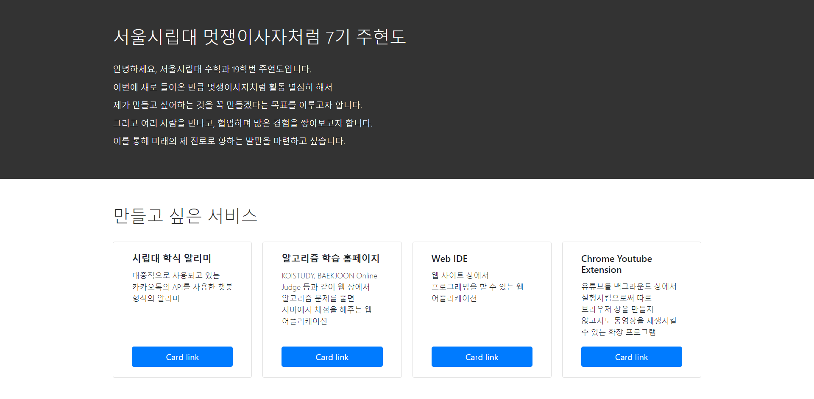

# Central Likelion First Assignment

After Learning Front-end Stack at UOS LIkelion class, We faced to first assignment of central likelion. It is to make homepage that introduce myself and services I want to create that I told at the interview. However, we had to use HTML/CSS/Bootstrap that learned at the likelion class. The capture image of my homepage is like below.

My homepage is divided into two section. Top section is introduction of me, and Bottom section is services that I want to create. In addition, Bottom section contains Bootstrap Modal that provide the details about service.

## Services that I want to create

1. 시립대 학식 알리미

   기존의 카카오톡을 사용한 알리미들은 대부분 미리 만들어져 있는 메뉴를 선택하여 정보를 얻는 방식입니다. 하지만 제가 원하는 방식은 사용자가 문구를 입력하면 서버에서 그 문구를 분석하여 원하는 정보를 출력하는 방식입니다. 예를 들어 만약 사용자가 "내일 점심 학생회관 학식 뭐야?"라고 입력을 하면 문장 및 핵심 키워드 분석을 통해 다음날 점심에 학생회관에서 제공하는 학식 리스트를 출력합니다. 그런 식으로 저는 챗봇이라는 이름에 걸맞은 서비스를 개발하고 싶습니다.

2. 알고리즘 학습 홈페이지

   널리 알려진 KOISTUDY, BAEKJOON Online Judge와 같은 웹 서비스와 같이 알고리즘 문제를 풀어서 제출하면 서버에서 채점한 후 사용자에게 알려주는 서비스입니다. 여기서 저는 학교 수업용으로도 사용할 수 있도록 수업 자료 게시판, 과제 제출 등의 부가 기능이 포함된 학교별 플랫폼을 제공할 수 있는 기능까지 포함된 웹 애플리케이션을 개발하고 싶습니다.

3. Web IDE

   컴파일러가 들어있는 프로그램을 따로 설치할 필요 없이 웹상에서 프로그래밍하고 컴파일하는 서비스입니다. 또한, Github와의 연동을 통해 언제든지 Repository를 불러와 파일을 수정하고 올릴 수 있는 기능을 생각하고 있고, 별도로 사용자가 원하는 폴더 및 파일을 만들어 코딩하고 저장할 수 있는 클라우드를 제공할 수 있는 기능을 담은 웹 애플리케이션을 개발하고 싶습니다.

4. Chrome Youtube Extension

   유튜브로 동영상이 아닌 음악을 들을 때에도 사용자는 따로 브라우저 창을 킨 후, 유튜브 사이트에 들어가 음악을 검색하고 재생시켜야 합니다. 따라서 저는 이러한 불편함을 최소화하기 위해 크롬 확장 프로그램으로써 백그라운드에서 유튜브를 재생시킬 수 있는 서비스를 개발하고 싶습니다.
